Hello Traders,

before you start copying my strategy, there are a few things you need to know about it. So please read the following:
 1. Most important: Don’t invest money that you can't afford to lose. The market always offers a chance to make profits, but there will always be a certain amount of risk.
 2. Be patient and copy for multiple months. Some months or even years will not work out strong, so be patient (see tables below, year 2019). If there is no good opportunity to trade, I just don´t trade. 
 3. Start copying while there is no open position. Don`t cash out money while there is an open position.
 4. The amount of the position is calculated as a percentage of the balance.
 5. I have three different strategies: They are all the same, but they differ in risk level.
	* Low risk: Long-term back tested low risk ([Link](http://www.blablameter.com/index.php)):
	* Middle risk: Long-term back tested middle risk ([Link](http://www.blablameter.com/index.php))
	* High risk: Long-term back tested high risk ([Link](http://www.blablameter.com/index.php))
 6. Account crashes are possible: For low risk and middle risk it didn’t happen within the past 6 years. For low risk it is very unrealistic to happen. For middle it might happen someday. For high risk it happened two times (2016 and 2018), after refunding the account it took 3 months to get the money back. Even in these years the results were highly positive (see tables below). 
 7. Many popular strategies crashed 2021/03/05. Even the High risk strategy didn’t crash that day.

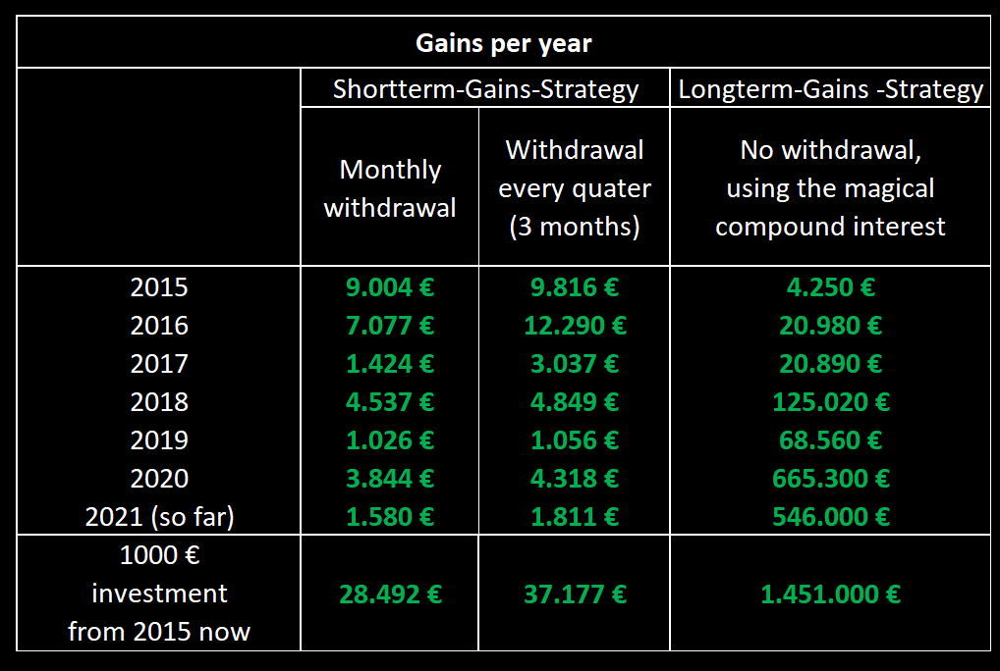

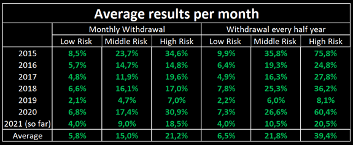

## Description of the strategy:

I have spent many years with forex trading and the stock market. This strategy is based on the Elliot-Wave-Theory and Fibonacci Retracement levels. It is a proven statistical approach.  Order filling and closing is done by a cBot. The advantage of automation is that the emotions of the trader are excluded. I observe the whole process by checking news regularly. It is a cBot with strict entry and exit rules, so that the strategy could be backtested, using the „Automate-Backtesting“ section of ICMarkets cTrader. For better synchronization and execution, you should also use ICMarkets.

I developed the strategy on the data of the last two years (2019/03/01-2021/02/28) and proved it during the previous four years (2015/03/01-2019/02/28) and the last week (March 2021).

The statistics show that the higher the risk is raised, the higher the average profits will be. So, if you try to make high profits, it is possible to lose money on your way, just to gain even more later the year.

I provide three different strategies: One high-risk, one low-risk and a middle-risk. **I recommend you to either cash out your profits at the end of each month, or to use the compounded interest and only cash out at the end of a half year** (End of June and end of December). That means you have six different possibilities to use these strategies. If you really like to use compounded interest use the low risk strategy and keep cash out after a couple years.

The tables show the money made during backtesting for every year back to 2015 and the average monthly results. Please be aware that some years are super strong (2015 and 2020), other years like 2019 are not that strong. Sometimes I don’t trade for an entire month, because no good situation occurred. This patience will be rewarded later.

To find out which strategy you should choose, look for the type that suits you best.

In the past six years the middle and the low risk strategy never failed. The high risk failed two times, which means that the account was empty at that time. This happened one time in 2016 and in 2018. As you see in the tables, even these years made a significant plus. The fails can be seen in the graphics below, they are red circled.

The three graphics in the following are the backtesting results of the three strategies using the cashout at the end of each month. Please note, that the cTrader Backtesting prints the number of trades on the x-axis, not the days and months. 

## Backtesting results

### Low Risk, withdrawal every month:

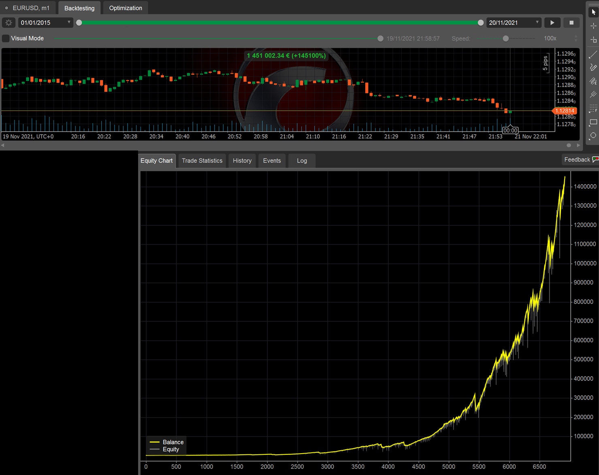

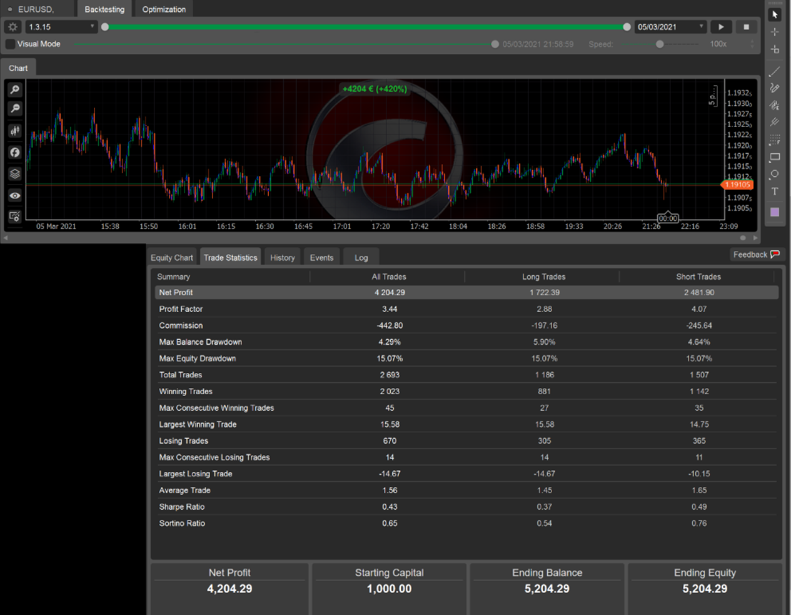

### Low Risk, withdrawal every half year:

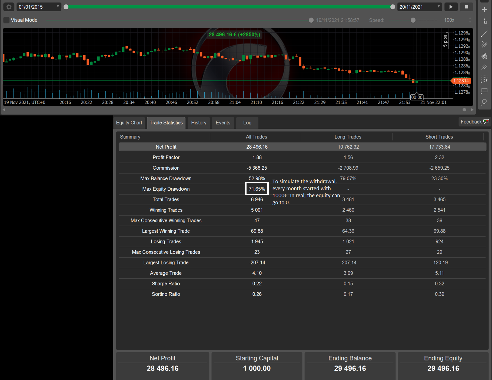

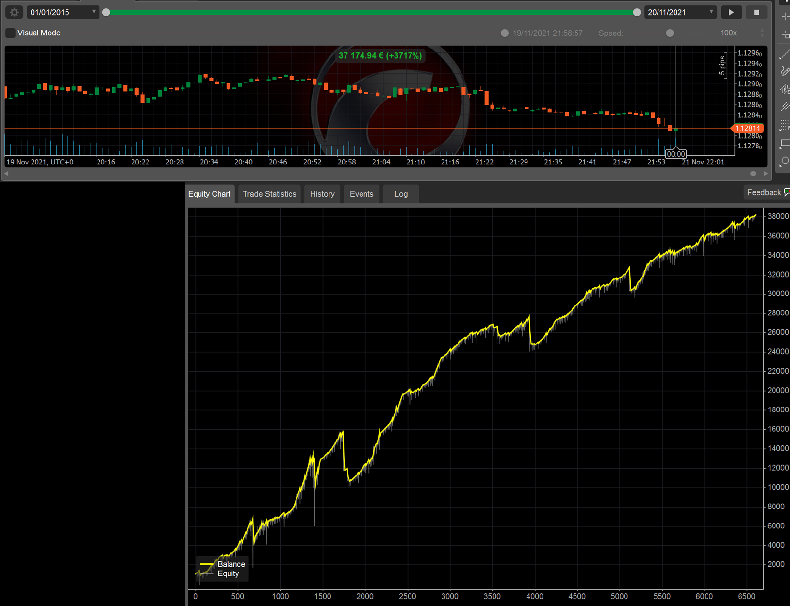

### Middle Risk, withdrawal every month:

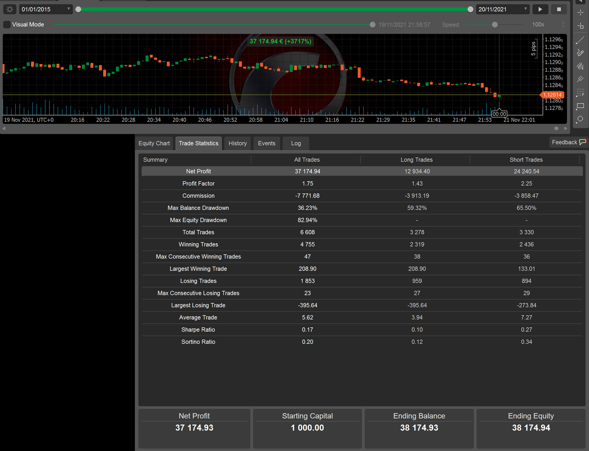

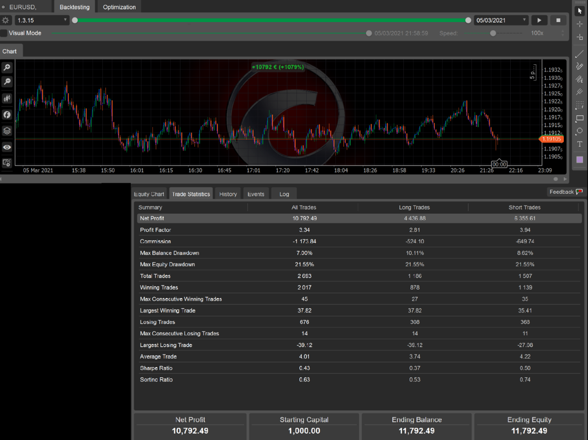

### Middle Risk, withdrawal every half year:

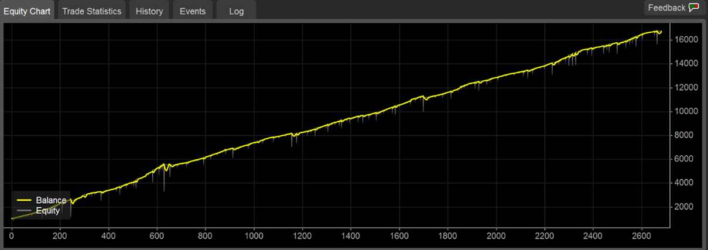

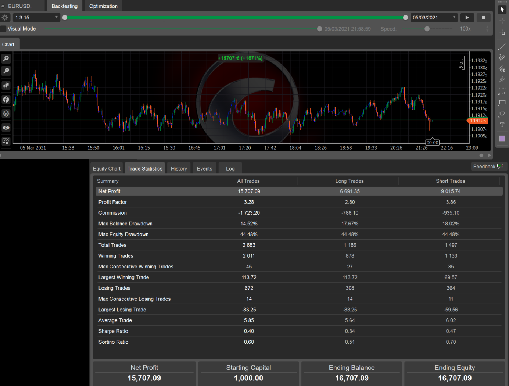

### High Risk, withdrawal every month:

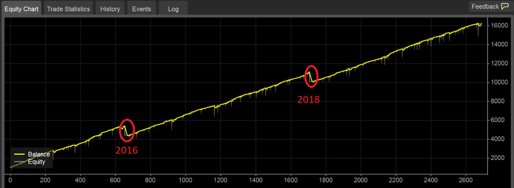

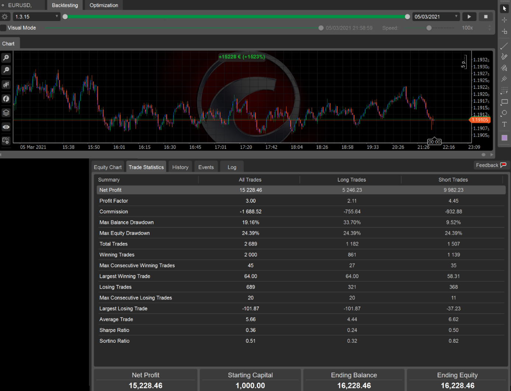

### High Risk, withdrawal every half year:

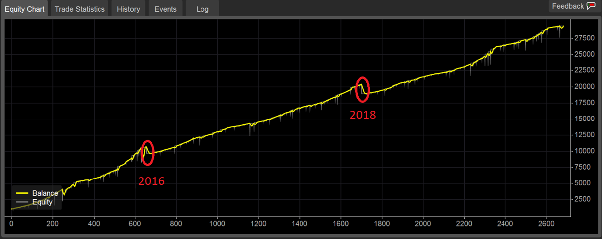

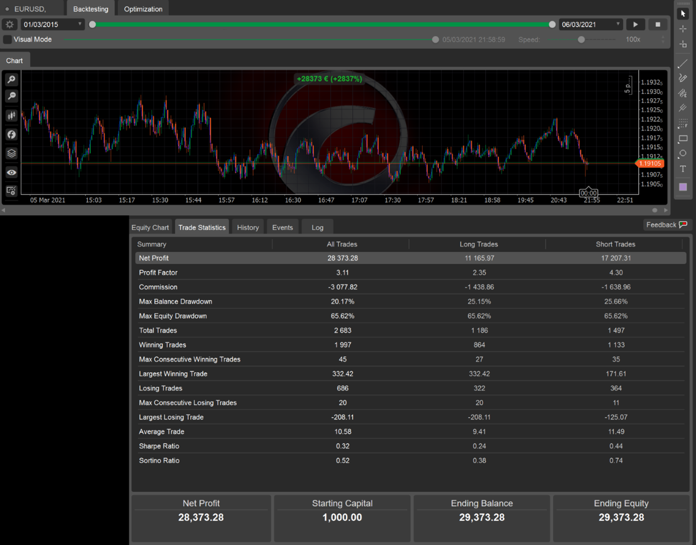

Regards,

TheBacktester
