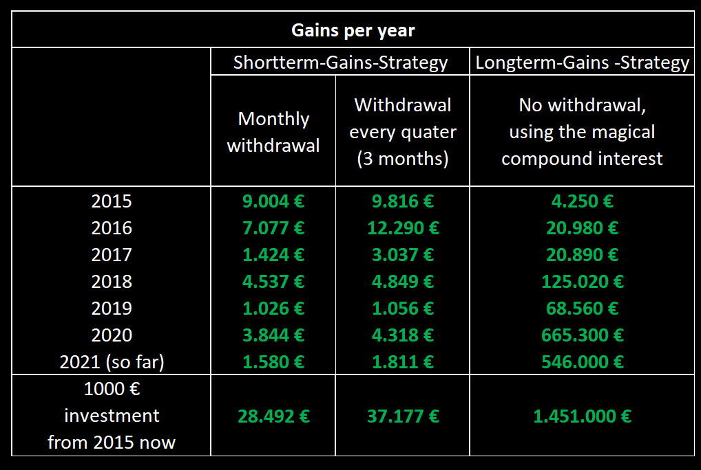
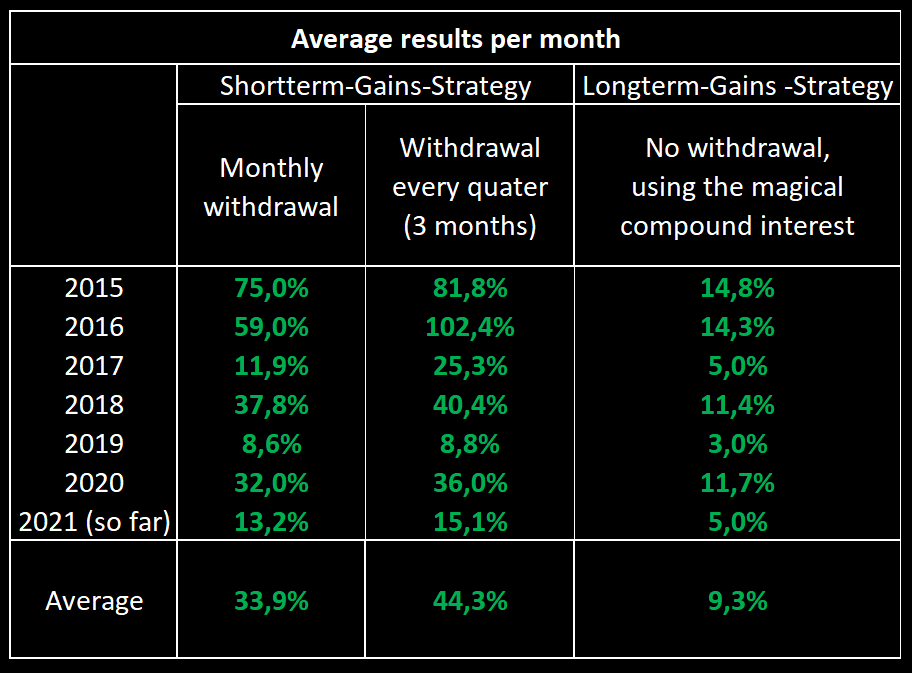
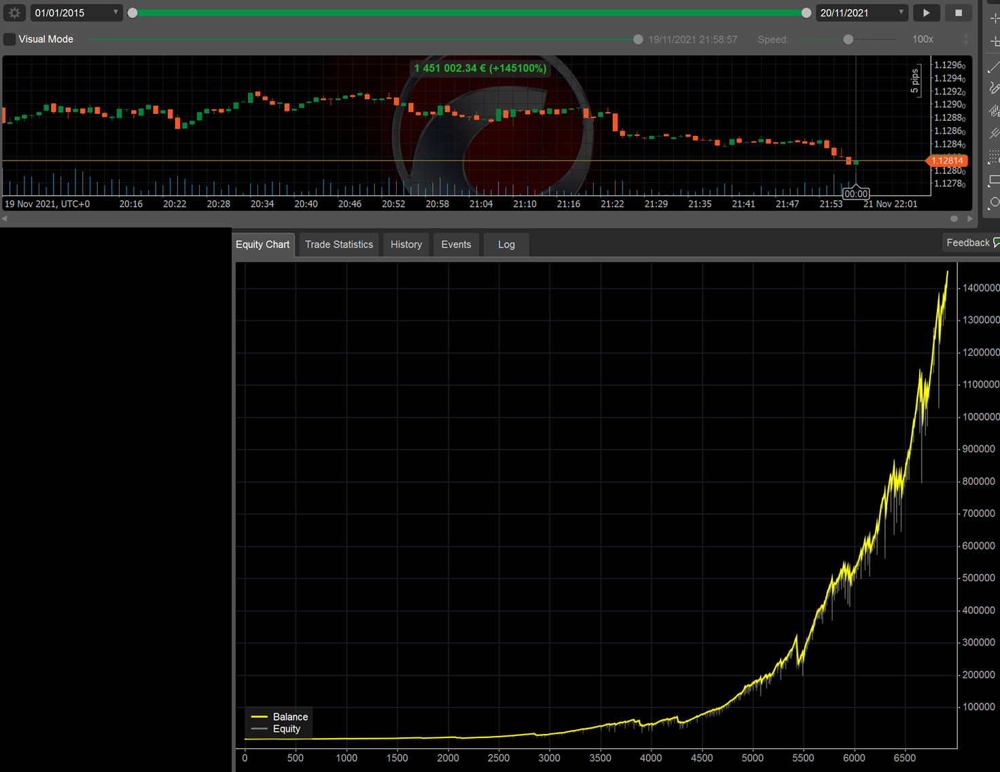
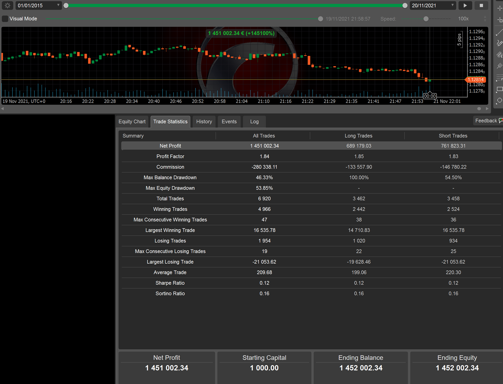
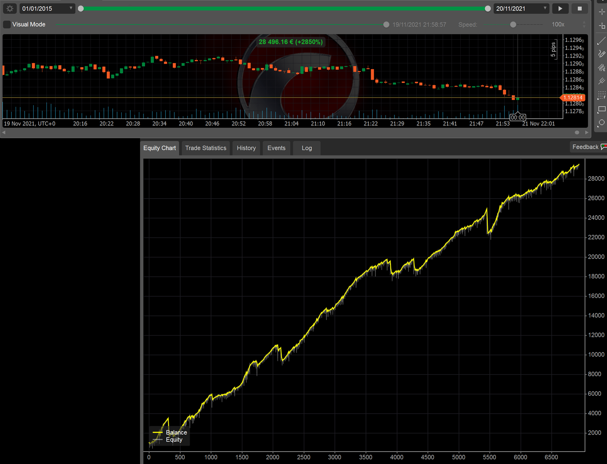
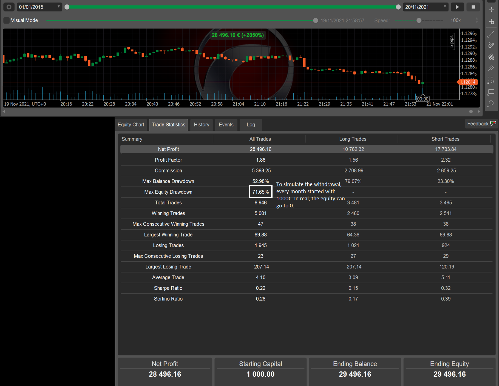
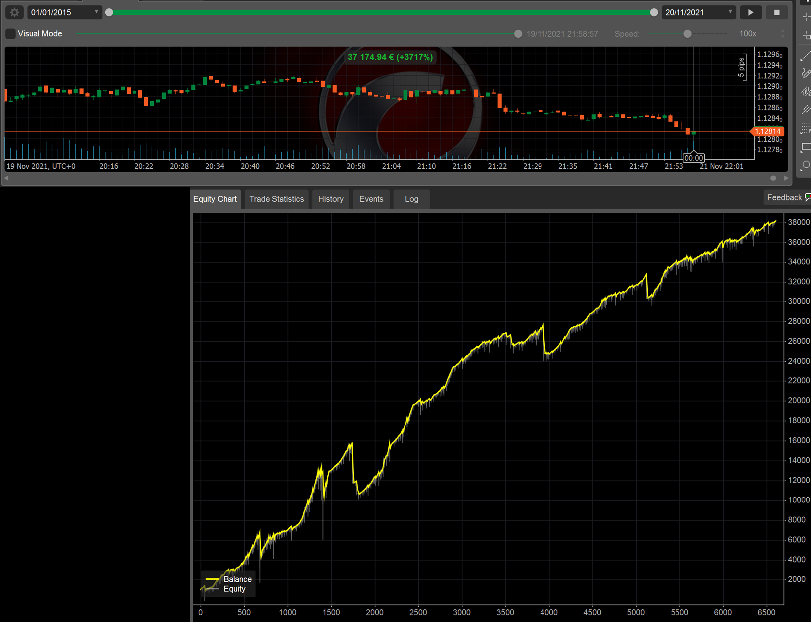
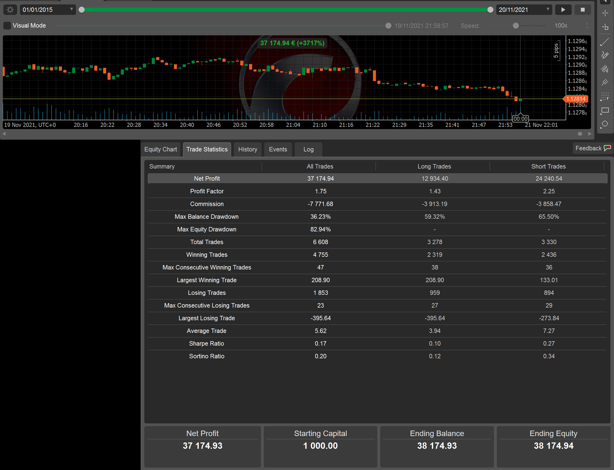

## Update of 23th Feb. 2022:
Both strategies dropped in beginning of February, I restarted the Shortterm-Gains-Strategy today. The Longterm-Gains-Strategy is still running since 20th Nov. 2021.

## Update of 20th Nov. 2021:
I already started the strategy in March 2021, but paused in June 2021 to rework the strategy.
The strategy is now reworked and is live at the 29th Nov. 2021

## Overview:
Hello Traders,

before you start copying my strategy, there are a few things you need to know about it. So please read the following:
 1. Be patient and copy for multiple months. Some months or even years will not work out strong, so be patient (see tables below, year 2019). If there is no good opportunity to trade, I just don´t trade. 
 2. Start copying while there is no open position. Don`t cash out money while there is an open position.
 3. The amount of the position is calculated as a percentage of the balance.
 4. I have two different strategies: 
	* Longterm-Gains: 7-years back-tested Longterm-Gains ([Link](https://ct-sc.icmarkets.com/copy/strategy/39183))
	* Shortterm-Gains: 7-years back-tested Shortterm-Gains ([Link](https://ct-sc.icmarkets.com/copy/strategy/42492))
 
I recommend to put 50% of your investment in Shorterm-Gains and 50% in Longterm-Gains. After a couple years switch to 30% Shorterm-Gains and 70% Longterm-Gains.
 
I keep you up to date on my telegram channel: [https://t.me/longterm_backtested_strategies](https://t.me/longterm_backtested_strategies)
The Longterm can be found on MyFxBook:([Link](https://www.myfxbook.com/members/TheBacktester/7-years-back-tested-longterm/9437514)) 

## Description of the strategy:

I have spent many years with forex trading and the stock market. This strategy is based on the Elliot-Wave-Theory and Fibonacci Retracement levels. It is a proven statistical approach.  Order filling and closing is done by a cBot. The advantage of automation is that the emotions of the trader are excluded. I observe the whole process by checking news regularly. It is a cBot with strict entry and exit rules, so that the strategy could be backtested, using the „Automate-Backtesting“ section of ICMarkets cTrader. For better synchronization and execution, you should also use ICMarkets.

The strategy is based on a nearly 7-year backtest, starting on 1rd Jan. 2015 until 19th Nov. 2021.

### The Longterm-Gains-Strategy 

* Has a Stoploss of 25%, which was hitted 11 times in the last 7 years. This strategy has an average of 9.3% per month and should be used to make profit out of compound interest.
* How to use the strategy: Make an initial deposit and be patient a couple years. Compound interest is a magical thing!
* **$1000 turned into over 1 Milion Dollars in just 7 years.**

### The Shortterm-Gains-Strategy 

* Trades higher amounts, but has no Stoploss. The monthly returns are consequently higher, but the entire account can crash, which happend 5 times in the last 7 years. 
* How to use the strategy: Make an initial deposit and withdrawal either at the end of each month or at the end of each quarter (every 3 months) for a slight use of compound interest.
* Even though the entire account can crash, there is a highly positive return (+2850% in 7 years). You just have to refund your account with you initial deposit, after a crash. The withdrawals secure your money.

## Backtesting results

The tables show the money made during backtesting for every year back to 2015 and the average monthly results. Please be aware that some years are super strong (2015, 2016 and 2020), other years like 2019 are not that strong. Sometimes I don’t trade for an entire month, because no good situation occurred. This patience will be rewarded later.

The graphics in the following are the backtesting results of the two strategies. 
For Shortterm-Gains using the monthly and the quarterly cashout. 
For Longterm-Gains no withdrawal is made.
Please note, that the cTrader Backtesting prints the number of trades on the x-axis, not the days and months. 

### Longterm-Gains-Strategy:

Note: The Equity Drawdown of 53% back in 2015 happend, because of two crashes in the same month. It took only two month to regain the lost money!

### Shortterm-Gains-Strategy, withdrawal every month:

### Shortterm-Gains-Strategy, withdrawal every quater (every 3 months):

in case of questions, feel free to contact me at [thebacktester.contact@gmail.com](mailto:thebacktester.contact@gmail.com) .

Regards,

TheBacktester 
