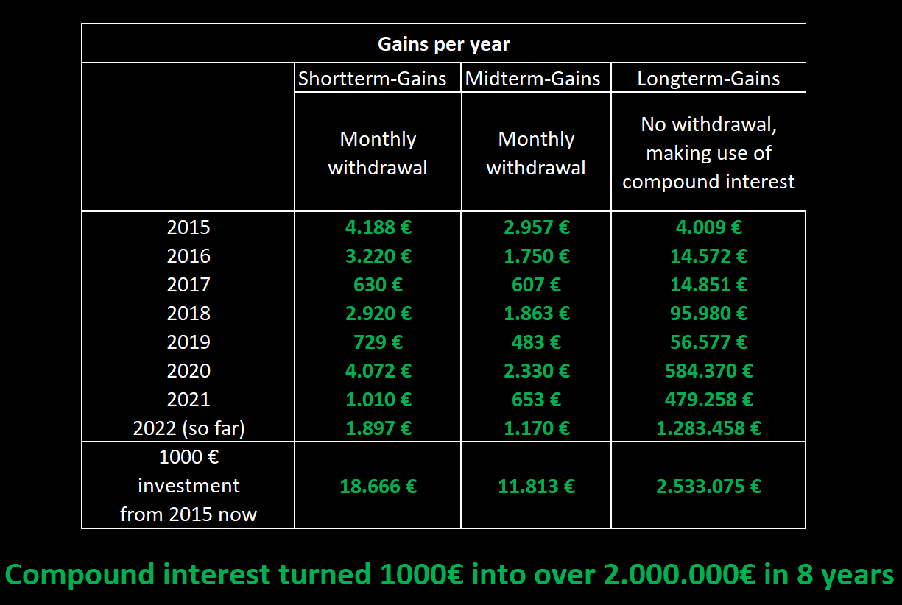
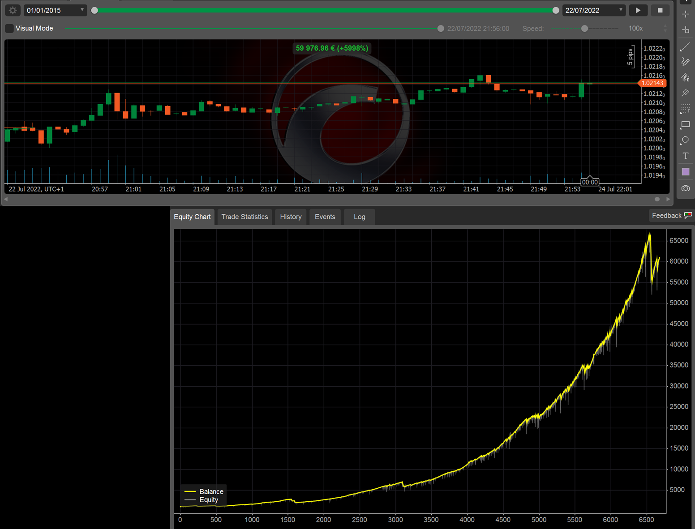
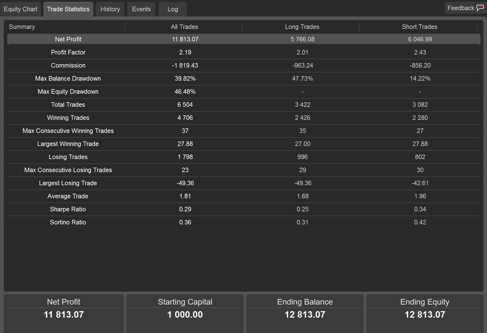
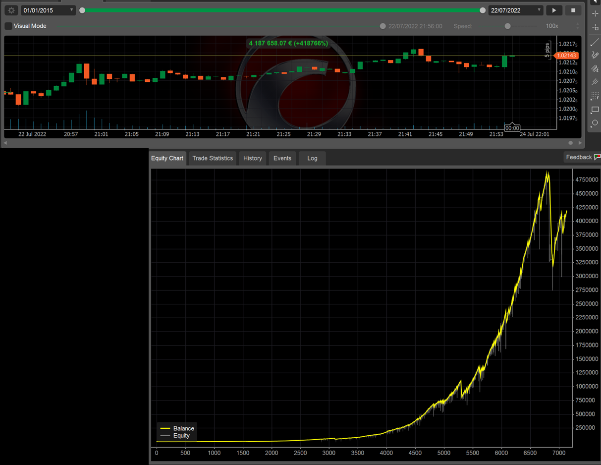
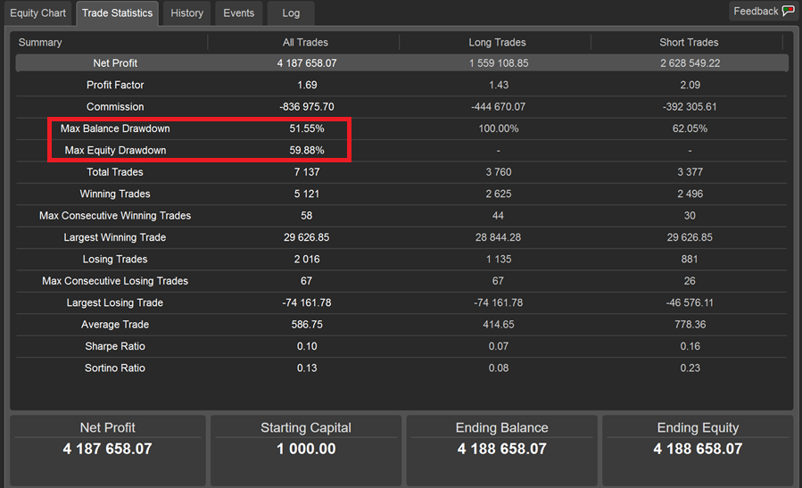
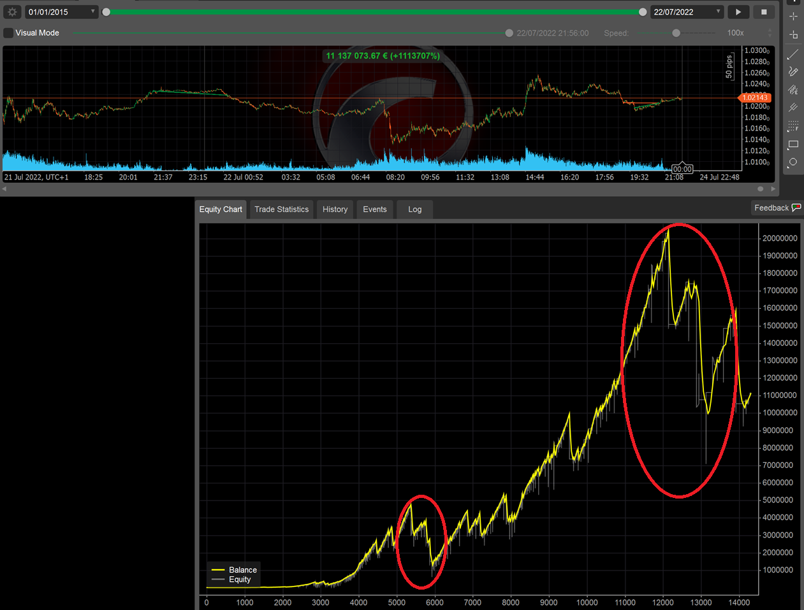
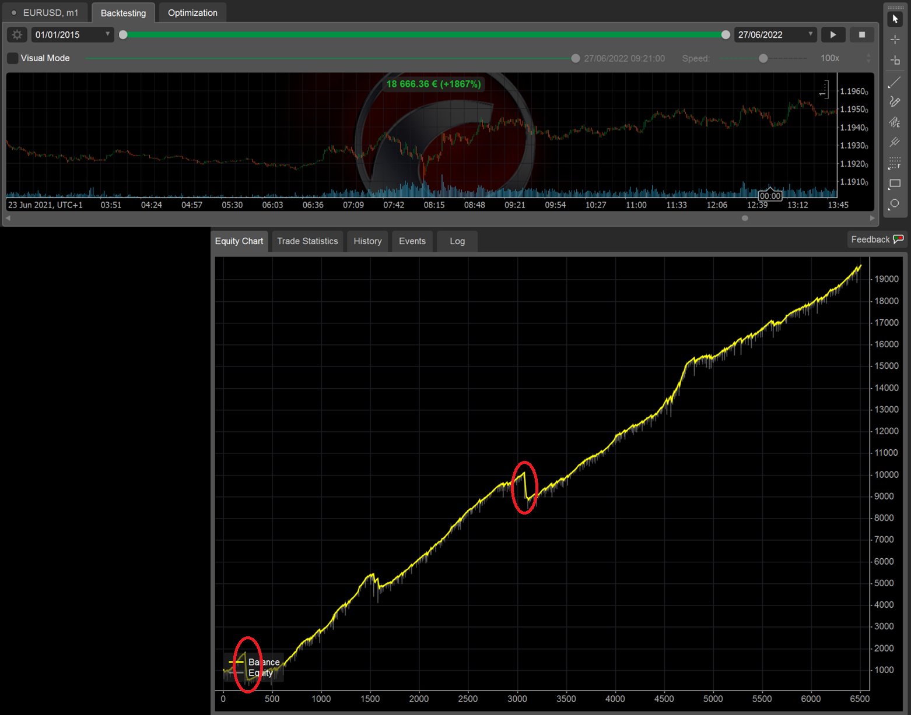

## Update of 24th Jul. 2022:
Shortterm-Gains and Longterm-Gains crashed 3 times during the live run in 2022. I paused the strategies to rework the code.
The strategies are live again the end of July.
I did three updates to prevent the crashes from happening again:	
* If the volatility exceeds twice the value from the previous period, no trades will be opened
* If a trendcomeback leads to a close of positions and then the trend continues, the close-level for new opened positions is calculated on the resuming trend-length. That leads to an earlier close.
* Crashes happen, especially during intense political times, therefore I reworked the strategies so that crashes are part of the normal buisness and do not kill the whole strategy

Both first mentioned changes led to hitting stoploss earlier, but have not been used before, because they also led to high wins in the past. The monthly wins in the past are now reduced.

Please be aware that hitting the stoploss will happen regularly. If you can't take a stoploss, don't even start copying.
The strategy is not over optimized, so that I expect similar market results in the future. BUT the strategy is still based on a backtest and the future might look different.

## Overview:
Hello Traders,

before you start copying my strategy, there are a few things you need to know about it. So please read the following:
 1. Be patient and copy for multiple months. Some months or even years will not work out strong, so be patient (see tables below, year 2019). If there is no good opportunity to trade, I just don´t trade. 
 2. Start copying while there is no open position. Don`t cash out money while there is an open position.
 3. The amount of the position is calculated as a percentage of the balance.
 4. I have three different strategies: 
	* Longterm-Gains: 7-years back-tested Longterm-Gains ([Link](https://ct-sc.icmarkets.com/copy/strategy/50970))
	* Midterm-Gains: 7-years back-tested Midterm-Gains ([Link](https://ct-sc.icmarkets.com/copy/strategy/50969))
	* Shortterm-Gains: 7-years back-tested Shortterm-Gains ([Link](https://ct-sc.icmarkets.com/copy/strategy/59921))
 
I keep you up to date on my telegram channel: [https://t.me/longterm_backtested_strategies](https://t.me/longterm_backtested_strategies)

The Midterm can be found on MyFxBook:([Link](https://www.myfxbook.com/members/TheBacktester/7-years-back-tested-longterm/9437514)) 

## Description of the strategy:

I have spent many years with forex trading and the stock market. This strategy is based on the Elliot-Wave-Theory and Fibonacci Retracement levels. It is a proven statistical approach.  Order filling and closing is done by a cBot. The advantage of automation is that the emotions of the trader are excluded. I observe the whole process by checking news regularly. It is a cBot with strict entry and exit rules, so that the strategy could be backtested, using the „Automate-Backtesting“ section of ICMarkets cTrader. For better synchronization and execution, you should also use ICMarkets.

The strategy is based on a more than 7-year backtest, starting on 1rd Jan. 2015 until 22th July 2022.

### The Longterm-Gains-Strategy 

* Has a Stoploss of 15%, which was hitted 8 times in the last 8 years. In 2016 it was hitted twice shortly after each other. This strategy has an average of 4.6% per month and should be used to make profit out of compound interest.
* How to use the strategy: Make an initial deposit and be patient a couple years.

### The Midterm-Gains-Strategy 

* Has a Stoploss of 25%, which was hitted 8 times in the last 8 years. In 2016 it was hitted twice shortly after each other. This strategy has an average of 9.6% per month and should be used to make profit out of compound interest.
* How to use the strategy: Make an initial deposit and be patient a couple years.
* **$1000 turned into over 4 Milion Dollars in just 8 years during the backtest.**

### The Shortterm-Gains-Strategy 

* Has a Stoploss of 25%, which was hitted 19 times in the last 8 years. It was hitted multiple times shortly after each other and is therefore risky that it crashes after the 4th time. This strategy has an average of 10.8% per month and should be used to make profit out of cashout regularly.
* How to use the strategy: Make an initial deposit and withdraw profits regularly. Be patient, this strategy might have longer negative phases.
* Please note that it took 14 months to regain the money lost during spring 2020 turbulences. Currently the strategy is about 50% away of the high water mark of early 2022.
* **$1000 turned into over 11 Milion Dollars in just 8 years during the backtest. But it is very risky and you should no keep high amounts in it unless you like the risk.**

## Backtesting results

The tables abovw shows the money made during backtesting for every year back to 2015 and the average monthly results. Please be aware that some years are super strong (2015, 2016 and 2020), other years like 2019 are not that strong. Sometimes I don’t trade for an entire month, because no good situation occurred. This patience will be rewarded later.

The graphics in the following are the backtesting results of the three strategies. 
Please note, that the cTrader Backtesting prints the number of trades on the x-axis, not the days and months. 

### Longterm-Gains-Strategy:

Note: The Equity Drawdown of 33% back in 2015 happened, because of two crashes in the same month. It took only two month to regain the lost money. Future regains may take longer.

### Midterm-Gains-Strategy:

Note: The Equity Drawdown of 60% back in 2015 happened, because of two crashes in the same month. It took only two month to regain the lost money. Future regains may take longer.

### Shortterm-Gains-Strategy:

Note: Multiple crash areas are red circled, it might happen in the future that multiple crashes in a row lead to a washout of the strategy. Therefore cash out money in regularly.

In case of questions, feel free to contact me at [thebacktester.contact@gmail.com](mailto:thebacktester.contact@gmail.com) .

Regards,

TheBacktester 
