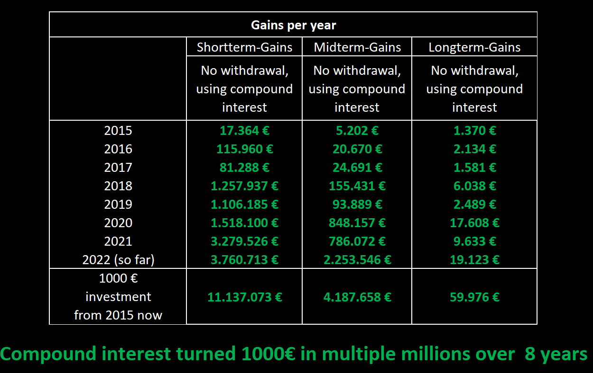
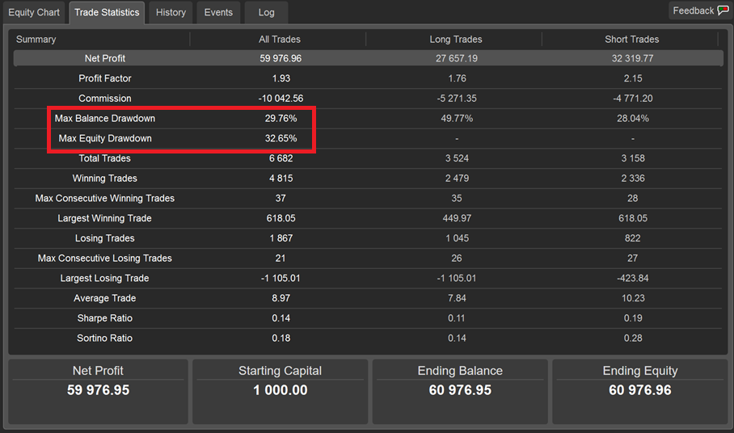

## Update of 03th Jul. 2022:
Shortterm-Gains and Longterm-Gains crashed 3 times during the live run in 2022. I paused the strategies to rework the code.
The strategies are live again the 05th of july.
I did two updates to prevent the crashes from happening again.
	* 1. If the volatility exceeds twice the value from the previous period, no trades will be opened
	* 2. If a trendcomeback leads to a close of positions and then the trend continues, the close-level for new opened positions is calculated on the resuming trend-length. That leads to an earlier close.
Both changes led to crashes earlier, but have not be used before because they also led to high wins in the past. The monthly wins in the past are now reduced but also the amount of crashes is reduced. For example Shortterm-Gains had 5 crashes during backtest and 3 during live run. The code update led to 2 crashes in backtest and no crashes in the "live" period. The monthly win for the whole period was reduced from 33% to 20%.

## Update of 20th Nov. 2021:
I already started the strategy in March 2021, but paused in June 2021 to rework the strategy.
The strategy is now reworked and is live at the 29th Nov. 2021

## Overview:
Hello Traders,

before you start copying my strategy, there are a few things you need to know about it. So please read the following:
 1. Be patient and copy for multiple months. Some months or even years will not work out strong, so be patient (see tables below, year 2019). If there is no good opportunity to trade, I just don´t trade. 
 2. Start copying while there is no open position. Don`t cash out money while there is an open position.
 3. The amount of the position is calculated as a percentage of the balance.
 4. I have three different strategies: 
	* Longterm-Gains: 7-years back-tested Longterm-Gains ([Link](https://ct-sc.icmarkets.com/copy/strategy/39183))
	* Midterm-Gains: 7-years back-tested Longterm-Gains ([Link](https://ct-sc.icmarkets.com/copy/strategy/39183))
	* Shortterm-Gains: 7-years back-tested Shortterm-Gains ([Link](https://ct-sc.icmarkets.com/copy/strategy/42492))
 
I recommend to put 50% of your investment in Shorterm-Gains or Midterm-Gains and 50% in Longterm-Gains. After a couple years switch to 30% Shorterm-Gains/Midterm-Gains and 70% Longterm-Gains.
 
I keep you up to date on my telegram channel: [https://t.me/longterm_backtested_strategies](https://t.me/longterm_backtested_strategies)
The Longterm can be found on MyFxBook:([Link](https://www.myfxbook.com/members/TheBacktester/7-years-back-tested-longterm/9437514)) 

## Description of the strategy:

I have spent many years with forex trading and the stock market. This strategy is based on the Elliot-Wave-Theory and Fibonacci Retracement levels. It is a proven statistical approach.  Order filling and closing is done by a cBot. The advantage of automation is that the emotions of the trader are excluded. I observe the whole process by checking news regularly. It is a cBot with strict entry and exit rules, so that the strategy could be backtested, using the „Automate-Backtesting“ section of ICMarkets cTrader. For better synchronization and execution, you should also use ICMarkets.

The strategy is based on a more than 7-year backtest, starting on 1rd Jan. 2015 until 29th Jun. 2022.

### The Longterm-Gains-Strategy 

* Has a Stoploss of 25%, which was hitted 8 times in the last 7 years. This strategy has an average of 9.1% per month and should be used to make profit out of compound interest.
* How to use the strategy: Make an initial deposit and be patient a couple years.
* **$1000 turned into over 2 Milion Dollars in just 8 years.**

### The Midterm-Gains-Strategy 

* Has a Stoploss of 50%, which was hitted 3 times during the backtest. This strategy trades half of the amount of Shortterm-Gains and has half the stoploss
* How to use the strategy: Make an initial deposit and withdrawal either at the end of each month or at the end of each quarter (every 3 months) for a slight use of compound interest. If you do not cashout you could have high compound interest but also risk to loose all if the crash happens two times in a row (which did not happen during backtesting but it might happen) 

### The Shortterm-Gains-Strategy 

* Trades higher amounts, but has no Stoploss. The monthly returns are consequently higher, but the entire account can crash, which happend 2 times in the last 7 years. 
* How to use the strategy: Make an initial deposit and withdrawal either at the end of each month or at the end of each quarter (every 3 months) for a slight use of compound interest.
* Even though the entire account can crash, there is a highly positive return (+1860% in 7 years). You just have to refund your account with you initial deposit, after a crash. The withdrawals secure your money.

## Backtesting results

The tables show the money made during backtesting for every year back to 2015 and the average monthly results. Please be aware that some years are super strong (2015, 2016 and 2020), other years like 2019 are not that strong. Sometimes I don’t trade for an entire month, because no good situation occurred. This patience will be rewarded later.

The graphics in the following are the backtesting results of the three strategies. 
For Shortterm-Gains and Midterm-Gains using cashout. 
For Longterm-Gains no withdrawal is made.
Please note, that the cTrader Backtesting prints the number of trades on the x-axis, not the days and months. 

### Longterm-Gains-Strategy:

Note: The Equity Drawdown of 53% back in 2015 happend, because of two crashes in the same month. It took only two month to regain the lost money

### Midterm-Gains-Strategy:

Note: The crashes are red circled, I start each month with the same initial amount, thats why a crash looks smaller in a long run backtest

### Shortterm-Gains-Strategy:

Note: The crashes are red circled, I start each month with the same initial amount, thats why a crash looks smaller in a long run backtest and does not look like a total crash of the account, but in fact it is one. Thats also why the max equity drawdown is at 75% and not 100%

In case of questions, feel free to contact me at [thebacktester.contact@gmail.com](mailto:thebacktester.contact@gmail.com) .

Regards,

TheBacktester 
